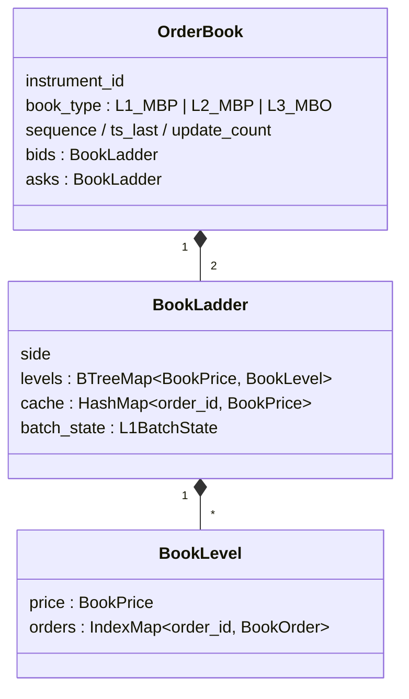
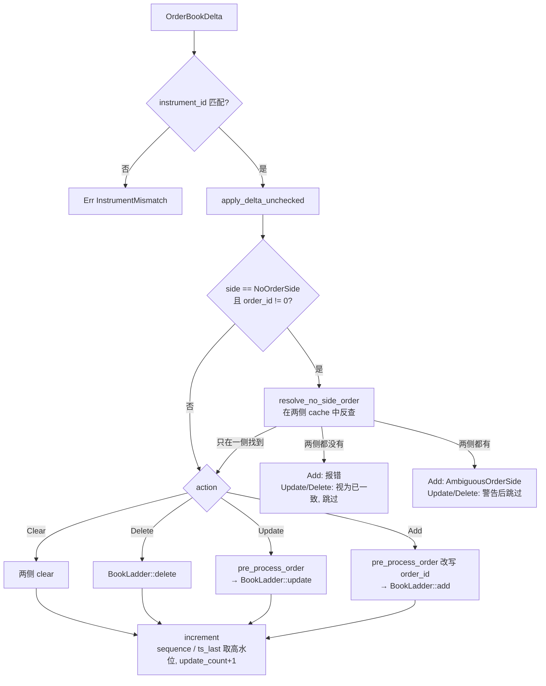

# 订单簿模块

> 一句话：**一套阶梯代码，通过改写 order_id 同时支持 L1 / L2 / L3 三种粒度的盘口。**

`crates/model/src/orderbook` 是 NautilusTrader 中所有盘口数据的落脚点：交易所推送的增量（`OrderBookDelta`）、
10 档快照（`OrderBookDepth10`）、报价与成交 tick，最终都变成对这里的 `OrderBook` 的修改。
回测撮合、策略读取盘口、从增量派生报价（`deltas_to_quotes`）都依赖它。

## 1. 数据结构：三层嵌套

| 层 | 类型 | 关键设计 |
|---|---|---|
| 簿 | `OrderBook` | 两条阶梯 + 元数据；`PartialEq` 只比较品种与簿类型，不比较内容 |
| 阶梯 | `BookLadder` | `BTreeMap<BookPrice, BookLevel>` 有序存储价位；`cache` 让按 order_id 定位订单为 O(1) |
| 价位 | `BookLevel` | `IndexMap` 同时提供按 ID 查找与插入顺序（时间优先 / FIFO） |

**`BookPrice` 的排序技巧**：它的 `Ord` 实现按方向反转——买盘价格降序、卖盘升序。于是两条阶梯的
`levels` 的**第一个元素永远是最优价位**，取最优价、按“由优到劣”遍历都不需要区分方向。
跨方向比较没有意义，`cmp` 中直接 `assert` 两侧方向相同，尽早暴露逻辑错误。

## 2. 一条增量的处理路径

要点：

- **方向反查**：部分交易所的修改 / 删除消息只带 order_id。`resolve_no_side_order` 借助两侧阶梯的 `cache` 补全方向；
  L2 簿的 order_id 是价格哈希，锁定盘口（bid == ask）时同一 ID 会同时出现在两侧，此时方向无法确定（`AmbiguousOrderSide`）。
- **乱序容忍**：`increment` 遇到 sequence 或 ts_event 回退只记警告、不拒绝，并对两者取最大值，保证元数据单调不减。
- **交叉清理**：`clear_stale_levels` 在最优买价 > 最优卖价时删除交叉区间内的整档价位，用于从漏掉删除消息的状态中恢复。

## 3. 一套代码，三种粒度：改写 order_id

`pre_process_order` 是整个模块最巧妙的地方。阶梯本身只认“订单”，三种粒度的差别全部通过**改写 order_id** 实现：

| 簿类型 | order_id 取值 | 效果 |
|---|---|---|
| `L1_MBP` | 订单方向（买 / 卖） | 每侧永远只有一个“订单”——最优报价 |
| `L2_MBP` | 价格的确定性哈希（固定种子 AHash） | 同一价位的更新覆盖同一个“订单”，天然按价位聚合 |
| `L3_MBO` | 交易所原始 ID | 逐笔跟踪；但带 `F_TOB` / `F_MBP` 标志或 ID 为 0 的数据按 L1 / L2 规则处理 |

价格哈希使用 AHash 而不是把价格直接截断为 `u64`：在 `high-precision` feature 下价格是 `i128`，截断会让不同价格碰撞到同一 ID。

### L1 的批处理状态机

L1 看似最简单，实际最复杂。交易所既会“单条替换”最优报价，也会把多条增量组成一批（以 `F_LAST` 结束），
还可能漏发 `F_LAST`。`BookLadder::handle_l1_add` 用 `L1BatchState`（None / MbpBatch / SnapshotBatch）区分当前批次类型：

- 非批次数据：先清空再写入（价格可以变差）；
- 批次数据：每次加入后 `retain_best_only` 只保留最优价位，即使永远收不到 `F_LAST` 也不会累积旧价位；
- MBP 批次与快照批次互不混用，避免残留的 MBP 数据污染新快照。

`retain_best_only` 不能逐档调用 `remove_level`：L1 中同侧所有订单共用一个合成 ID，删除任一价位都会把仍在使用的 ID 从缓存中删掉，
所以它保留最优价位后整体重建 `cache`。

## 4. 不变式

模块中大量的 `debug_assert!` 都在守护同一组不变式：

1. **缓存一致**：`cache.len()` 等于所有价位上的订单总数；`cache` 中不存在已删除价位的引用。
2. **ID 唯一位置**（L2 / L3）：一个 order_id 在同一侧只位于一个价位。以新价格再次加入同一 ID 时，订单从旧价位移到新价位的**队尾**
   （失去时间优先级，与交易所改价规则一致），不会留下“幽灵订单”。
3. **价位非空**：价位上最后一个订单被删除时，整个价位从 `levels` 中移除。
4. **FIFO**：`BookLevel` 删除订单用 `shift_remove` 而不是 `swap_remove`，保持其余订单的先后顺序。

`analysis::book_check_integrity` 可在运行时检查簿类型相关的约束：L1 每侧最多一档、L2 每档最多一个订单，
以及盘口不得**严格**交叉（bid == ask 的锁定盘口是合法的）。

## 5. 自有订单簿与过滤视图

`OwnOrderBook` 只记录“我自己”挂出的订单（以 `ClientOrderId` 为键），不参与撮合。
`OrderBook::filtered_view_checked` 用它从公共盘口中扣除自己的挂单，得到**别人提供的流动性**——做市和下单决策需要的是这个视图，
否则策略会把自己的挂单误当成对手盘。可以按订单状态和“被交易所确认多久”（`accepted_buffer_ns`）过滤要扣除的订单。

`OwnOrderBook::combined_with_opposite` 面向“是 / 否”互补的二元市场：在对立品种上的买单等价于在本品种上以 `1 - price` 卖出。

## 6. 推荐阅读顺序

1. `ladder.rs` 中的 `BookPrice`（排序技巧）与 `BookLadder::add / update / remove_order`；
2. `level.rs`（FIFO 价位）；
3. `aggregation.rs` 的 `pre_process_order`（三种粒度的统一）；
4. `book.rs` 的 `apply_delta_unchecked` → `increment`；
5. `ladder.rs` 的 `handle_l1_add` 与 `retain_best_only`（L1 批处理）；
6. `own.rs` 与 `OrderBook::filtered_view_checked`。

源码中的 【zh】 注释与本文分工：注释讲“这一段”，本文讲“这一片”。
